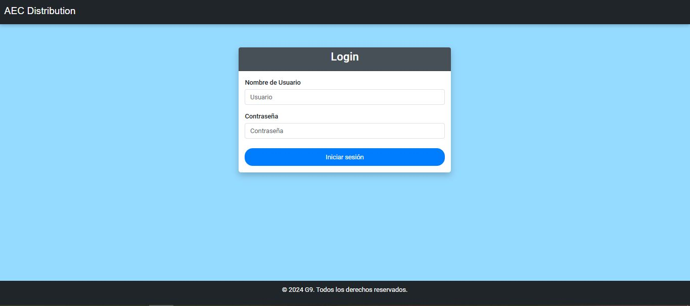
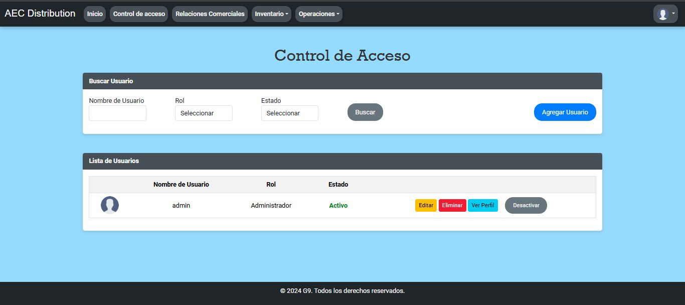

# Web Application for Purchase and Sales Management

## Description

This web application is designed to manage purchases and sales for a multi-purpose business. The system enables the management of customers, suppliers, and products, as well as the recording of sales and purchases. Products are categorized by brands and types/categories. Additionally, the system tracks current stock levels and minimum stock thresholds to facilitate purchase planning.

## Features

1. **Customer and Supplier Management:**
   - Add, remove, and modify customers and suppliers.

2. **Product Management:**
   - Add, remove, and modify products.
   - Manage brands and types/categories.
   - Maintain current stock and minimum stock levels.

3. **Purchase Registration:**
   - Record purchases by specifying the supplier and acquired product.
   - Automatically update stock levels and record purchase prices.

4. **Sales Registration:**
   - Sales form where the customer is assigned, and the product to be sold is selected.
   - Validation of available stock quantities.
   - Automatic stock deduction upon completing a sale.
   - Generation of unique-numbered invoices for printing.

5. **Sales Price Calculation:**
   - Each product has an assigned profit percentage.
   - The selling price is calculated by applying the profit percentage to the most recent purchase price.

6. **Security:**
   - Login with username and password.
   - User roles: Seller and Administrator.
     - **Seller:** Records transactions, manages inventory, and establishes new business relationships.
     - **Administrator:** Has full access to all system functionalities.

## Requirements

- .NET Framework
- SQL Server
- Visual Studio

## Installation

1. Clone the repository:
   ```bash
   git clone https://github.com/AlejoLg1/tpc-equipo-9A.git
   
2. **Create the Database**: Locate and execute the provided SQL script in the SQLScripts folder to create the database and necessary tables.

3. Open your C# IDE (e.g., Visual Studio or Visual Studio Code).

4. Open the solution in the IDE.

5. Initialize your connectionString variable inside the Web.config file. This will allow the application to connect to your database.

6. **Compile the solution**: In the IDE, select the option to compile the solution. This will ensure that all files are built correctly.

## Screenshots



